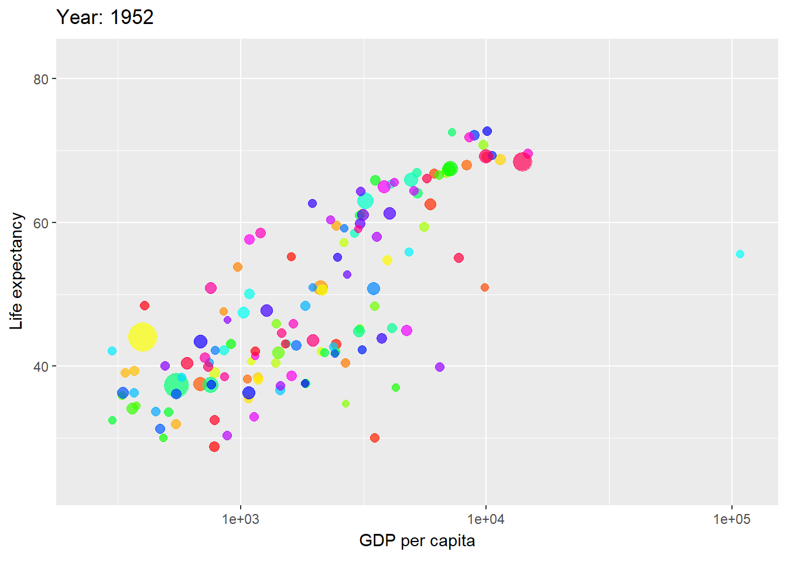
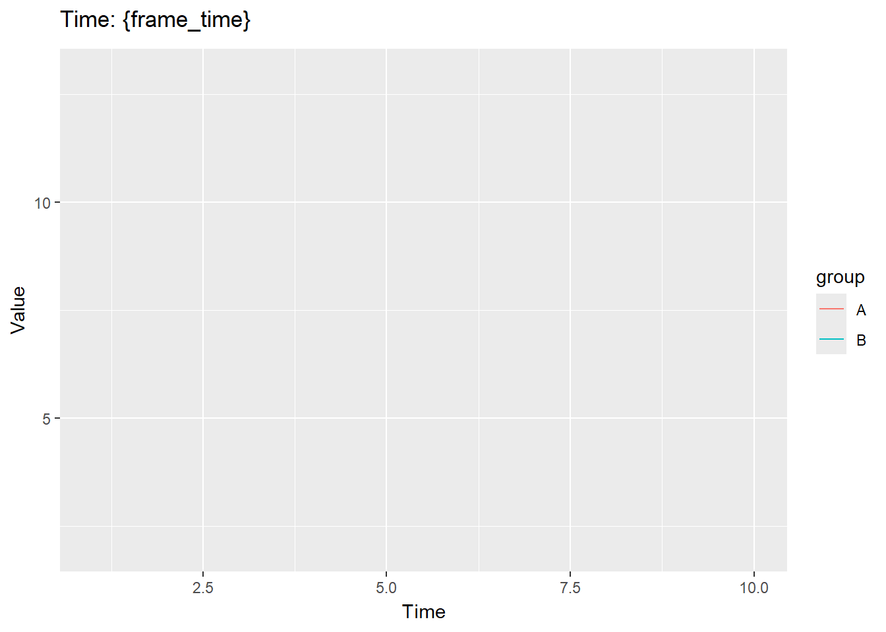
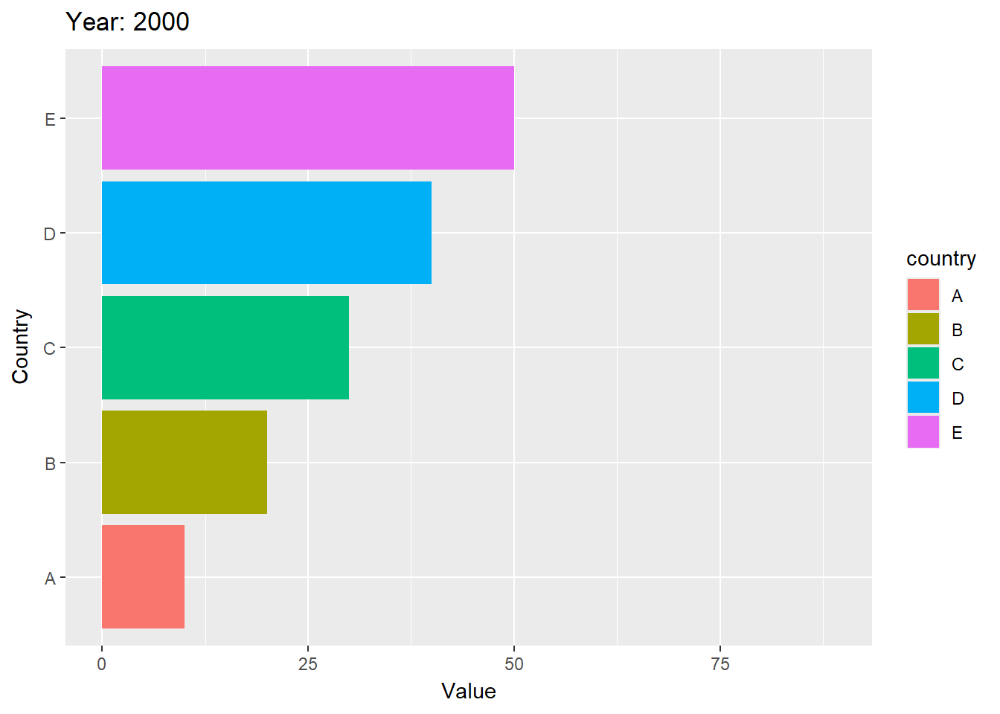
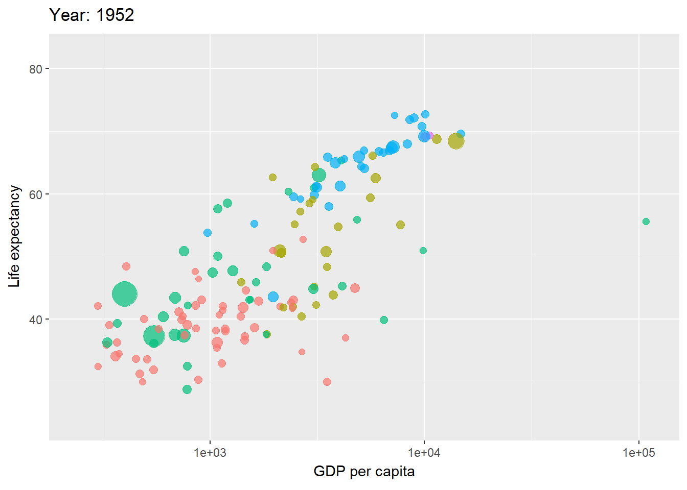
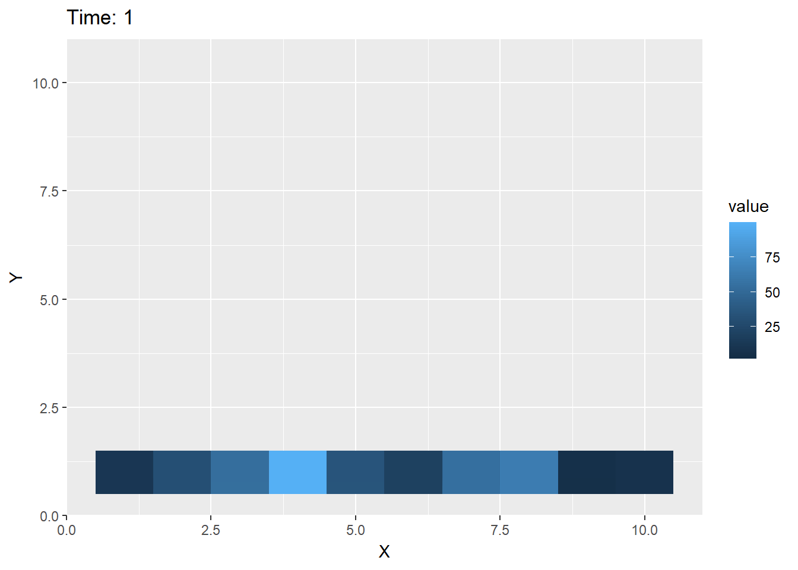
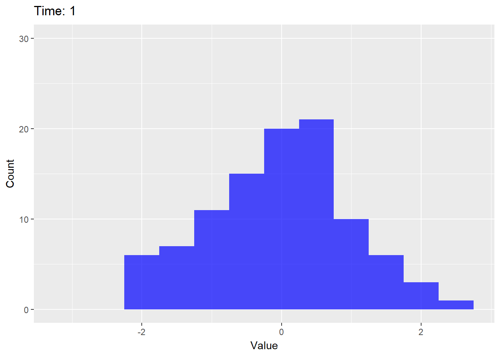
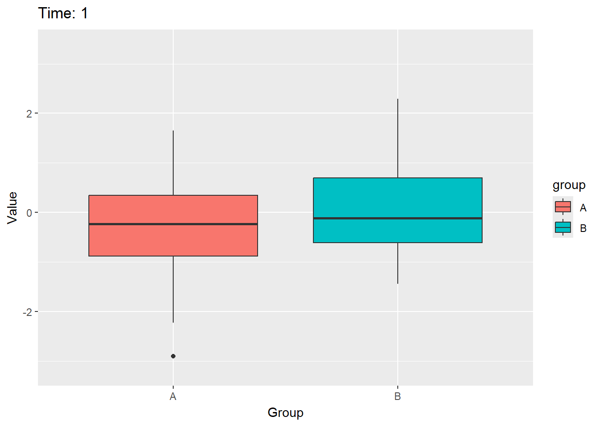
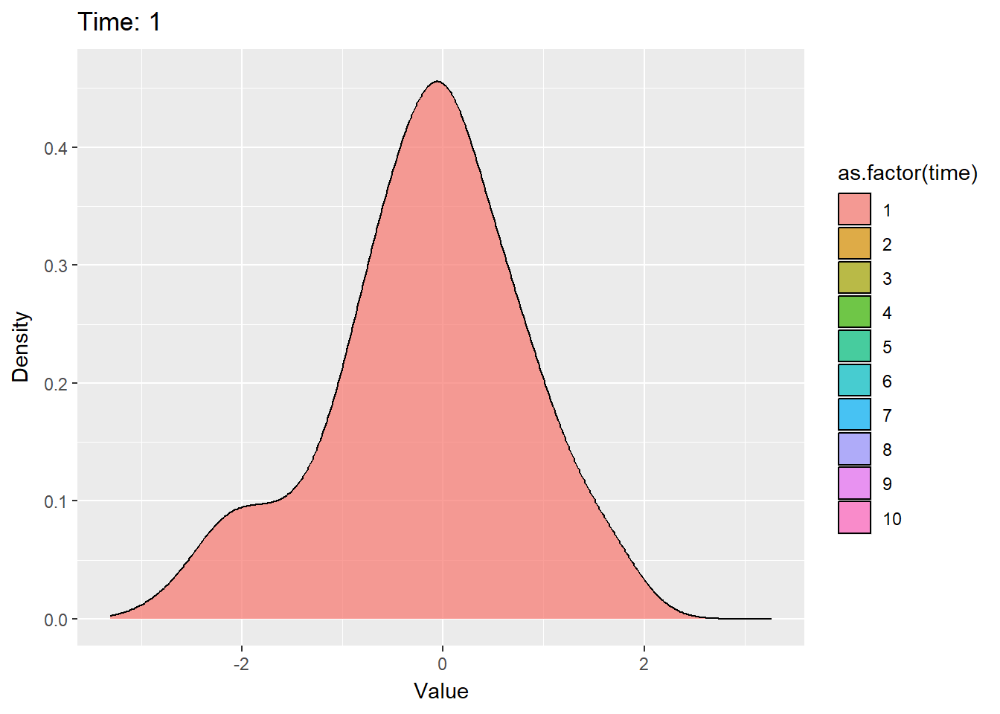
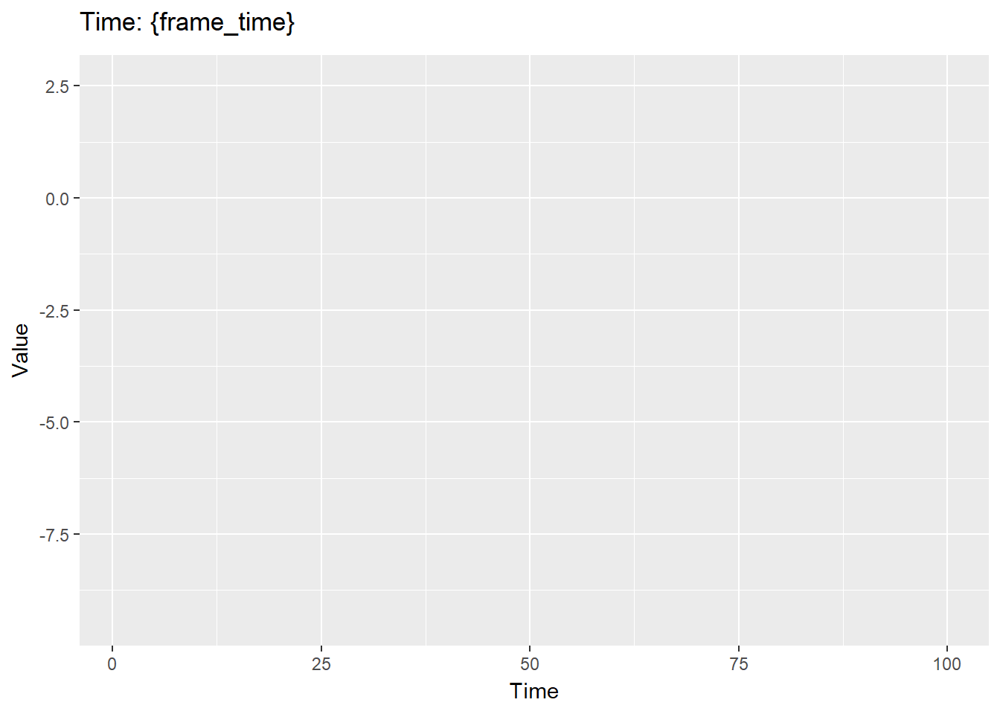
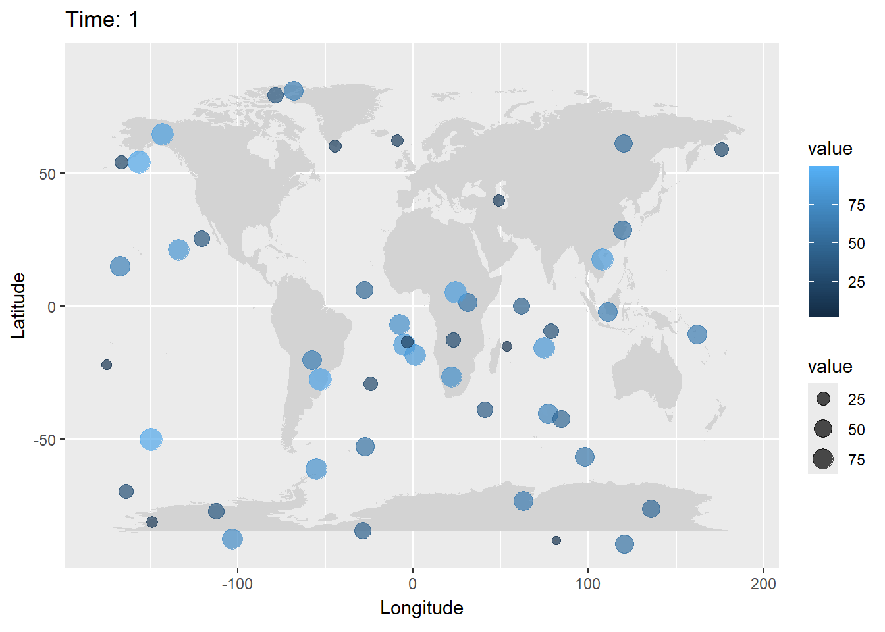

# **Animated Plots in R**

Animated plots are dynamic visualizations that show changes over time or other dimensions. The `gganimate` package is commonly used for creating animated plots in R. It extends `ggplot2` by adding animation capabilities.

## Examples of Animated Plots

1.  **Scatter Plot**
2.  **Line Plot**
3.  **Bar Chart**
4.  **Bubble Chart**
5.  **Heat map**
6.  **Histogram**
7.  **Box plot**
8.  **Density Plot**
9.  **Time Series**
10. **Map Chart**

```{r}
# load necessary packages
library(ggplot2)
library(gganimate)
library(gapminder)
library(gifski)
library(av)
```

**Scatter Plot**

```{r}
# Define country colors (optional; remove if not needed)
country_colors <- rainbow(length(unique(gapminder$country)))
names(country_colors) <- unique(gapminder$country)

# Create a basic scatter plot
p <- ggplot(gapminder, aes(gdpPercap, lifeExp, size = pop, color = country)) +
  geom_point(alpha = 0.7, show.legend = FALSE) +
  scale_colour_manual(values = country_colors) +
  scale_size(range = c(2, 12)) +
  scale_x_log10() +
  labs(title = "Year: {frame_time}", x = "GDP per capita", y = "Life expectancy")

# Add animation
anim <- p + transition_time(year) + ease_aes("linear")

# Save the animation as a GIF
anim_save("animated_scatter_plot.gif", animation = anim, renderer = gifski_renderer())


```

**Line Plot**

```{r}
# load necessary packages
library(ggplot2)
library(gganimate)

# Create a sample data frame
data <- data.frame(
  time = rep(1:10, each = 2),
  value = c(3, 5, 2, 4, 6, 8, 7, 9, 5, 6, 4, 7, 8, 10, 9, 11, 10, 12, 11, 13),
  group = rep(c("A", "B"), times = 10)
)

# Create a basic line plot
p <- ggplot(data, aes(x = time, y = value, color = group, group = group)) +
  geom_line() +
  labs(title = "Time: {frame_time}", x = "Time", y = "Value")

# Add animation
anim <- p + transition_reveal(time)

# Save the animation as a GIF
anim_save("animated_line_plot.gif", animation = anim, renderer = gifski_renderer())


```

**Bar Chart**

```{r}
# load necessary packages
library(ggplot2)
library(gganimate)
library(dplyr)

# Create a sample data frame
data <- data.frame(
  year = rep(2000:2005, each = 5),
  country = rep(c("A", "B", "C", "D", "E"), times = 6),
  value = c(10, 20, 30, 40, 50, 15, 25, 35, 45, 55, 20, 30, 40, 50, 60, 25, 35, 45, 55, 65, 30, 40, 50, 60, 70,56,57,89,76,49)
)

# Create a basic bar chart
p <- ggplot(data, aes(x = reorder(country, value), y = value, fill = country)) +
  geom_bar(stat = "identity") +
  coord_flip() +
  labs(title = "Year: {frame_time}", x = "Country", y = "Value")

# Add animation
anim <- p + transition_time(year) + ease_aes("linear")

# Save the animation as a GIF
anim_save("animated_bar_plot.gif", animation = anim, renderer = gifski_renderer())


```

**Bubble Chart**

```{r}
# load necessary packages
library(ggplot2)
library(gganimate)
library(gapminder)

# Create a basic bubble chart
p <- ggplot(gapminder, aes(gdpPercap, lifeExp, size = pop, color = continent)) +
  geom_point(alpha = 0.7, show.legend = FALSE) +
  scale_size(range = c(2, 12)) +
  scale_x_log10() +
  labs(title = "Year: {frame_time}", x = "GDP per capita", y = "Life expectancy")

# Add animation
anim <- p + transition_time(year) + ease_aes("linear")

# Save the animation as a GIF
anim_save("animated_bubble_plot.gif", animation = anim, renderer = gifski_renderer())


```

**Heatmap**

```{r}
# load necessary packages
library(ggplot2)
library(gganimate)
library(reshape2)

# Create a sample data frame
data <- data.frame(
  time = rep(1:10, each = 10),
  x = rep(1:10, times = 10),
  y = rep(1:10, each = 10),
  value = runif(100, 1, 100)
)

# Reshape the data
data_melt <- melt(data, id.vars = c("time", "x", "y"))

# Create a basic heat map
p <- ggplot(data_melt, aes(x = x, y = y, fill = value)) +
  geom_tile() +
  labs(title = "Time: {frame_time}", x = "X", y = "Y")

# Add animation
anim <- p + transition_time(time) + ease_aes("linear")

# Save the animation as a GIF
anim_save("animated_heatmap_plot.gif", animation = anim, renderer = gifski_renderer())


```

**Histogram**

```{r}
# load necessary packages
library(ggplot2)
library(gganimate)

# Create a sample data frame
data <- data.frame(
  time = rep(1:10, each = 100),
  value = rnorm(1000)
)

# Create a basic histogram
p <- ggplot(data, aes(x = value)) +
  geom_histogram(binwidth = 0.5, fill = "blue", alpha = 0.7) +
  labs(title = "Time: {frame_time}", x = "Value", y = "Count")

# Add animation
anim <- p + transition_time(time) + ease_aes("linear")

# Save the animation as a GIF
anim_save("animated_histogram_plot.gif", animation = anim, renderer = gifski_renderer())


```

**Boxplot**

```{r}
# load necessary packages
library(ggplot2)
library(gganimate)

# Create a sample data frame
data <- data.frame(
  time = rep(1:10, each = 100),
  value = rnorm(1000),
  group = rep(c("A", "B"), times = 500)
)

# Create a basic boxplot
p <- ggplot(data, aes(x = group, y = value, fill = group)) +
  geom_boxplot() +
  labs(title = "Time: {frame_time}", x = "Group", y = "Value")

# Add animation
anim <- p + transition_time(time) + ease_aes("linear")

# Save the animation as a GIF
anim_save("animated_box_plot.gif", animation = anim, renderer = gifski_renderer())


```

**Density Plot**

```{r}
# load necessary packages
library(ggplot2)
library(gganimate)

# Create a sample data frame
data <- data.frame(
  time = rep(1:10, each = 100),
  value = rnorm(1000)
)

# Create a basic density plot
p <- ggplot(data, aes(x = value, fill = as.factor(time))) +
  geom_density(alpha = 0.7) +
  labs(title = "Time: {frame_time}", x = "Value", y = "Density")

# Add animation
anim <- p + transition_time(time) + ease_aes("linear")

# Save the animation as a GIF
anim_save("animated_density_plot.gif", animation = anim, renderer = gifski_renderer())


```

**Time Series**

```{r}
# load necessary packages
library(ggplot2)
library(gganimate)

# Create a sample data frame
data <- data.frame(
  time = 1:100,
  value = cumsum(rnorm(100))
)

# Create a basic time series plot
p <- ggplot(data, aes(x = time, y = value)) +
  geom_line() +
  labs(title = "Time: {frame_time}", x = "Time", y = "Value")

# Add animation
anim <- p + transition_reveal(time)

# Save the animation as a GIF
anim_save("animated_time_series_plot.gif", animation = anim, renderer = gifski_renderer())


```

**Map Chart**

```{r}
# load necessary packages
library(ggplot2)
library(gganimate)
library(maps)

# Create a sample data frame
data <- data.frame(
  time = rep(1:10, each = 50),
  long = runif(500, -180, 180),
  lat = runif(500, -90, 90),
  value = runif(500, 1, 100)
)

# Create a basic map plot
world_map <- map_data("world")
p <- ggplot() +
  geom_polygon(data = world_map, aes(x = long, y = lat, group = group), fill = "lightgray") +
  geom_point(data = data, aes(x = long, y = lat, size = value, color = value), alpha = 0.7) +
  labs(title = "Time: {frame_time}", x = "Longitude", y = "Latitude")

# Add animation
anim <- p + transition_time(time) + ease_aes("linear")

# Save the animation as a GIF
anim_save("animated_map_plot.gif", animation = anim, renderer = gifski_renderer())


```
